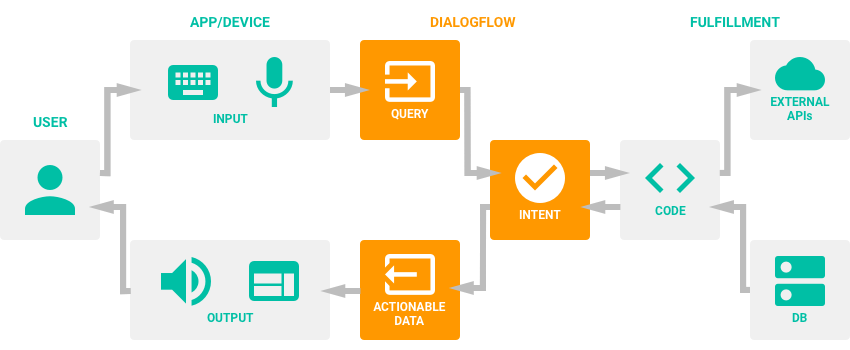

# Thesis
# Dao Nam Tien - 20182 - HUST

## App React-Native

## Chat bot

### Một số lý thuyết cơ bản

* Agents:
	- Agents là miêu tả cụ thể nhất của NLU ( Hiểu ngôn ngữ tự nhiên ).
	- Agents có thể được đưa vào: ứng dụng, sản phẩm, dịch vụ của bạn và chuyển đổi yêu cầu người dùng tự nhiên thành dữ liệu có thể thực hiện được.
	- Sự chuyển đổi đó xuất hiện khi đầu vào của một người dùng phù hợp với một trong những tính năng bên trong tác nhân của bạn.
	- Intents ( ý định ): là các thành phần được xác định trước hoặc do nhà phát triển xác định của các Agents xử lý yêu cầu của người dùng.
	- Agents có thể được thiết kế để quản lý luồng hội thoại theo một hướng cụ thể.
	Nó có thể hoàn thành với sự trợ giúp của Contexts ( ngữ cảnh ), độ ưu tiên Intents, slot filling, responsiblilities và fulfillment thông qua webhook
	
	